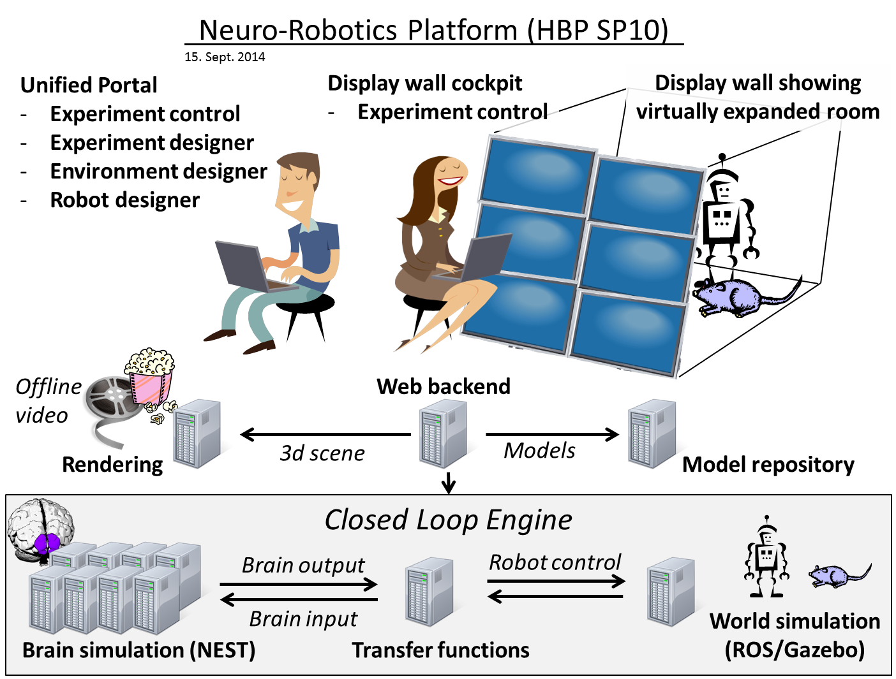
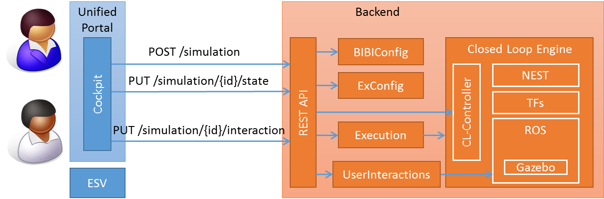

========================
NRP Backend Architecture
========================

Purpose
-------

The NRP Backend is responsible for providing a REST API to create and control experiment simulations. For each experiment simulation a Closed Loop Engine (CLE) is started to run it. 

.. _architecture-overview:

   Overview of HBP SP10

:num:`Fig. #architecture-overview` shows the overview of the Neurorobotics subproject SP10 of the Human Brain Project (HBP). The NRP Backend provides a REST API to create and control experiment simulations.

Architecture of the NRP Backend
-------------------------------

.. _architecture-components:

   Architecture of NRP backend with frontend as context

:num:`Fig. #architecture-components` shows the architecture of the NRP Backend together with the frontend as context. The REST API takes request 
from the frontend and forwards them to the backend component related to a request. Creating a new simulation triggers the generation of a launch script for the CLE from the experiment configuration :class:`hbp_nrp_backend.exd_config`. This is done by modules :class:`hbp_nrp_backend.exd_config.experiment_configuration_script`. Requesting a state change triggers a transition between simulation states, see :doc:`simulation_states` for details. Requesting an interaction is directly forwarded to the Closed Loop Engine.

Details on the REST API can be found here: :doc:`REST-API`.

