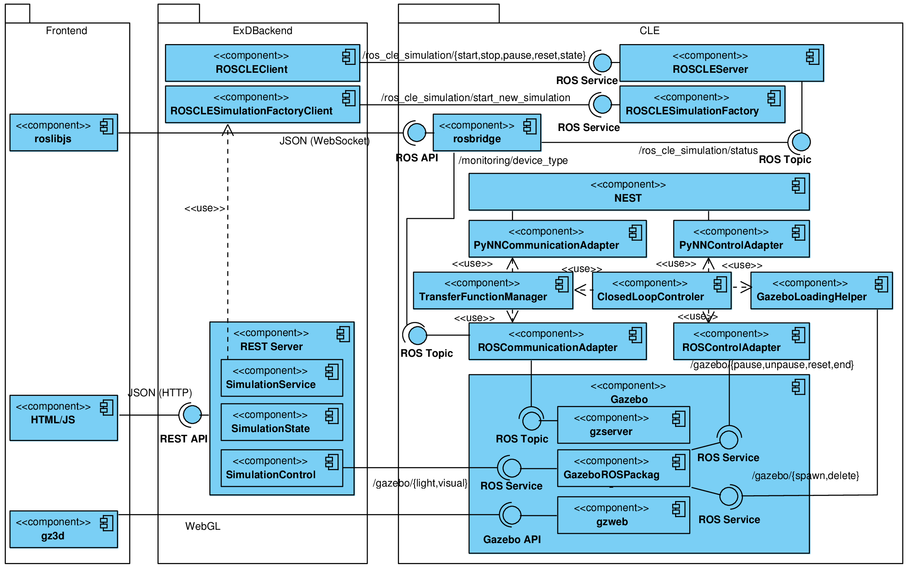

======================
NRP Communication Flow
======================

The communication and data flow of the Neurorobotics Platform (NRP) is shown in :num:`Fig. #communication-flow`. The diagram includes all communication and data flows between the three main components (frontend, backend and CLE) as well as the most important communication and data flows within the components.

.. _communication-flow:

   Overview of communication and data flow of the NRP

Frontend
--------

The frontend basically calls the REST API of the backend via HTTP using JSON for data transfer. For rendering the frontend can directly access the Gazebo API running in the CLE by using gzweb/gz3d. In addition the frontend subscribes to ROS topics in the CLE for status updates (*/ros_cle_simulation/status*) and monitoring brain/robot activities (*/monitoring/'device_type'*) by using rosbridge.

Backend
-------

The REST Server uses the classes :class:`hbp_nrp_backend.cle_interface.RSOCLESimulationFactoryClient` and :class:`hbp_nrp_backend.cle_interface.ROSCLEClient` to start and control the CLE. Both classes communicate with their counter part in the CLE by calling ROS services (*/ros_cle_simulation/start_new_simulation*) to launch the CLE and (*/ros/cle_simulation/{start,stop,pause,reset,stop}*) to control the CLE.
In addition the backend is able to call ROS services of Gazebo (*/gazebo/{light,visual}*) to perform events and interactions with the environment of the simulation.

Closed Loop Engine
------------------

The CLE internal communication is basically done via ROS services and topics. See CLE documentation for more details.

