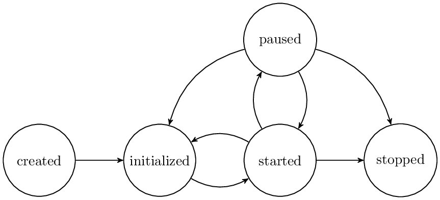

==========================================
Lifecycle state machine of the NRP Backend
==========================================

.. _state-machine:

    The state machine of the NRP Backend

The state machine of our current implementation of the NRP backend is depicted in :num:`Fig. #state-machine`.
It shows the allowed transitions between states, including failure transitions.
The initial *created* state is reached after a *POST /simulation* request.
Transitions between states are triggered by a *PUT /simulation/{id}/state* with the transition trigger as body, which is mostly the destination state.
For example, the transition to initialize a freshly created simulation is triggered by *initialized* and will execute the *initialize* trigger,
depicted in :num:`Fig. #state-machine` through the arrow *initialized->initialize*.
When a transition is triggered, one of the transition implementations is executed, *initialize*, *start*, *pause*, *stop*, *fail* or *reset*.
If any transition fails, the state machine resides in its current state and an automatic *failed* transition is triggered.
Except for the reset transition that is a looping transition, all transitions will be ignored if they are issued multiple times.
For example, the lifecycle state machine will not raise an error when it receives an *initialized* trigger while in *paused* state, but will simply ignore it
because the simulation is already initialized. However, if the simulation already is in *started* state, the lifecycle will raise an exception and refuse the trigger
because *initialized* is not a valid trigger for a simulation in *started* state.

See :doc:`REST-API` for details on requests to NRP Backend API.

The state machine allows multiple instances of itself that are distributed over multiple machines and
have different implementations of the transition functions. These instances automatically synchronize using a ROS topic.
This means, when one instance of the lifecycle state machine changes the state of the simulation, all other
instances are notified through this ROS topic. Any other instance will pick up this message and synchronize automatically,
but not propagate this synchronized change any further in order to avoid endless loops.

However, for this synchronization to work, any lifecycle instance will use the name of its encapsulating ROS node
to identify from which instance the synchronization message came from. Therefore, only one lifecycle state machine
per ROS node and synchronization topic is allowed. Therefore, we use separate ROS topics for each simulation.
The ROS topics currently used are **/ros_cle_simulation/<simulation id>/lifecycle**.