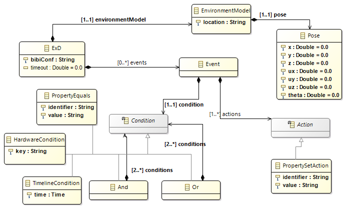

Tutorial: Writing an Experiment Configuration
=============================================

File format
^^^^^^^^^^^

The Experiment Configuration (ExD Configuration) is shown in :num:`Fig. #exd-config`.

.. _exd-config:

    The Experiment configuration at a glance

An experiment configuration consists of an **ExD** root element. This element contains the
information which environment model is used and how the robot is placed into the environment.
For the positioning, the model element **Pose** is used.

Furthermore, the ExD Config may define multiple user events. These events have a condition when they
appear and define multiple actions that are defined in this case.

Currently, we only support setting a property to a given value as actions. This may be extended in
later stages of the project.

The conditions can be that a given property has a given value, a hardware key can be pressed or a
given moment in a timeline. Currently, we do not allow stochastical expressions but the time when
the event shall occur must be fixed. This is also subject to change in future versions.

Conditions can be combined using **Or** or **And** conjunctions to support more complex conditions.

.. note::
    This ExD Config is currently not used. In particular, the supported events are hardcoded.
    In a later stage of the project, we want to generate event support from the ExD Configuration.

.. warning::
    Because we have not used the events of the ExD Configuration at all yet, this part of the ExD
    Config metamodel is fragile and subject to change. In particular, new requirements may demand
    for more expressiveness for the events conditions and actions which must be implemented in the
    metamodel.

The ExD Configuration for the Braitenberg vehicle experiment running with the Husky in the virtual room
^^^^^^^^^^^^^^^^^^^^^^^^^^^^^^^^^^^^^^^^^^^^^^^^^^^^^^^^^^^^^^^^^^^^^^^^^^^^^^^^^^^^^^^^^^^^^^^^^^^^^^^

This tutorial shows how to create an experiment configuration to run the Braitenberg Demo with the Husky robot in the virtual
room with some interactions.

We begin by declaring a new ExD Configuration.

.. code-block:: xml

    <ExD xmlns:xsi="http://www.w3.org/2001/XMLSchema-instance"
         xmlns="http://schemas.humanbrainproject.eu/SP10/2014/ExDConfig">
    </ExD>

The namespace for the ExDConfig is necessary for tools to recognize the XML root element as ExDConfig.

The first thing that we need is a declaration of the environment model, i.e. the virtual room. This is done by the following XML:

.. code-block:: xml

    <environmentModel>
        <location>virtual_room/virtual_room.sdf</location>
        <pose>
            <x>0.0</x>
            <y>0.0</y>
            <z>0.0</z>
            <ux>0.0</ux>
            <uy>0.0</uy>
            <uz>1.0</uz>
            <theta>0.0</theta>
        </pose>
    </environmentModel>

Here, we specify the path to the environment model (relative to the **NRP_MODELS_DIRECTORY** environment variable).
Furthermore, we specify where the robot should be placed. The example shown can be used as default, setting the robot (we have not specified which robot to use, yet) in
the center of the room.

The second and probably most important thing to specify is the BIBI Configuration. This is again referenced by the file name relative to
**NRP_MODELS_DIRECTORY**.

.. code-block:: xml

    <bibiConf>BIBI/milestone2.xml</bibiConf>

The BIBI Configuration itself specifies which robot model to use, which brain model to use and how connect the two of them using Transfer Functions.

In theory, our ExD Configuration is already valid. However, we have not specified any events yet, so no interactions with the simulation is possible except for the light that can be controlled.

.. warning:: At the moment, events are not implemented so they are just ignored. However, in the future it will get important to create events in order to interact with the simulation.
